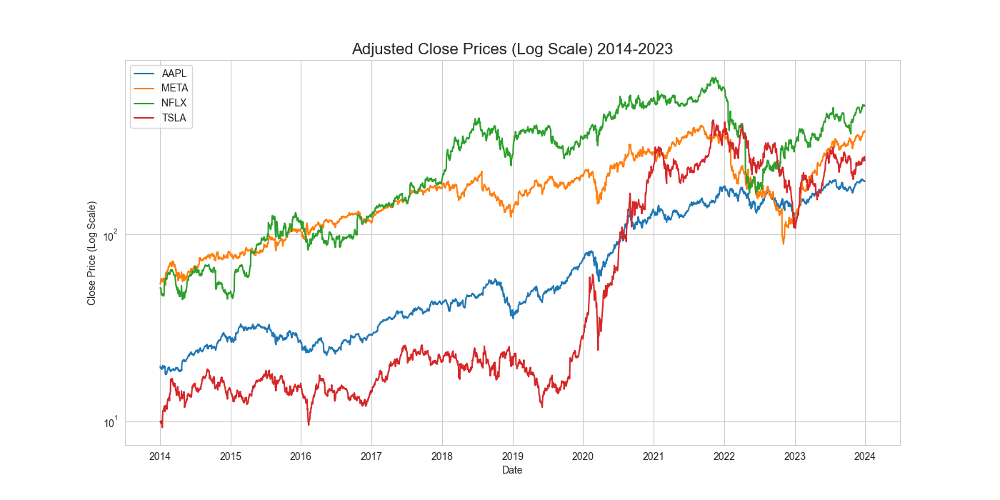
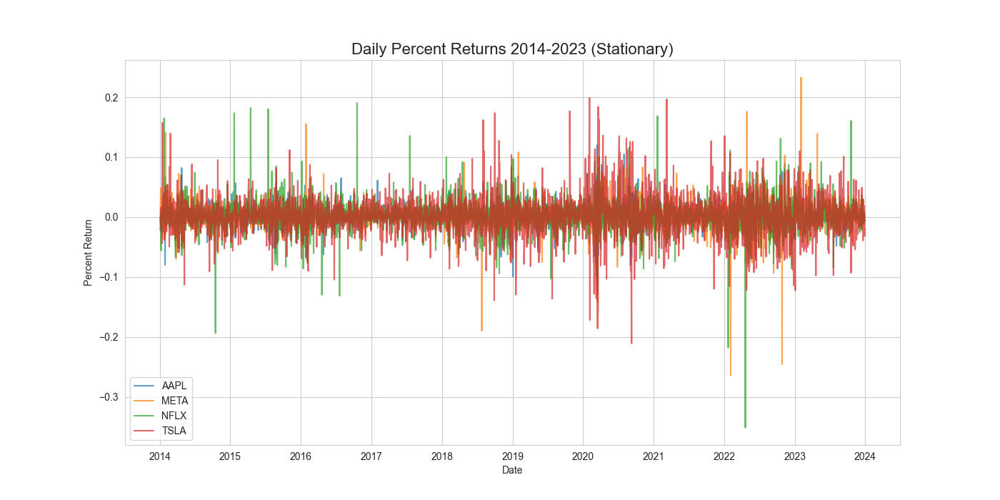
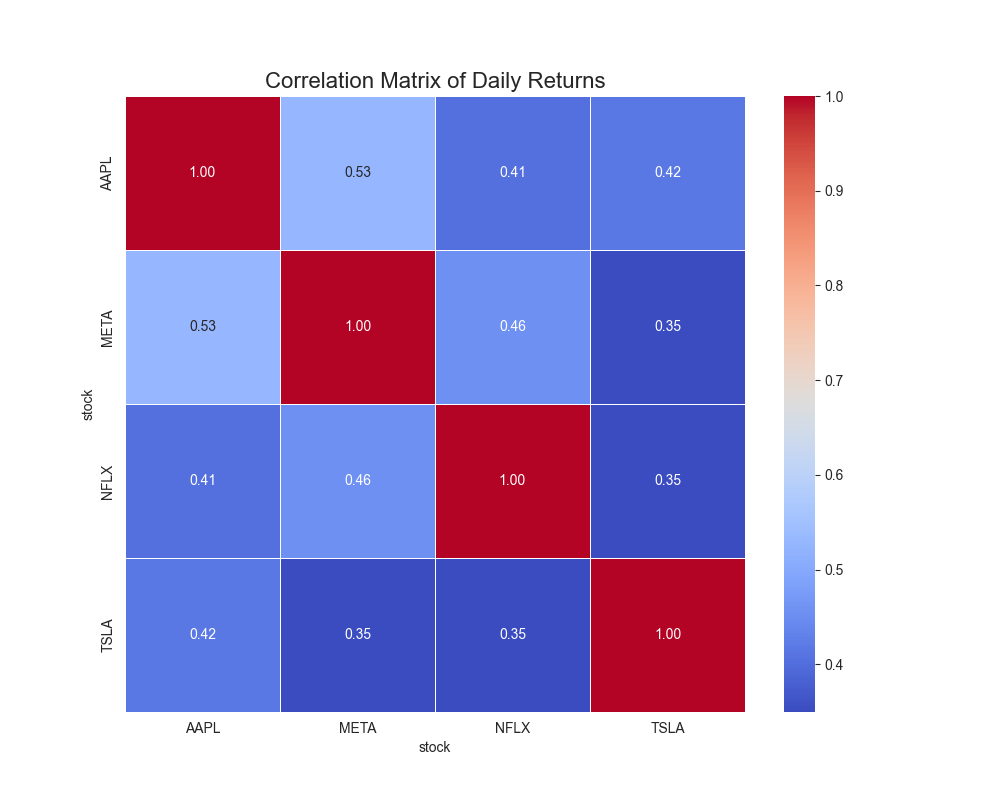
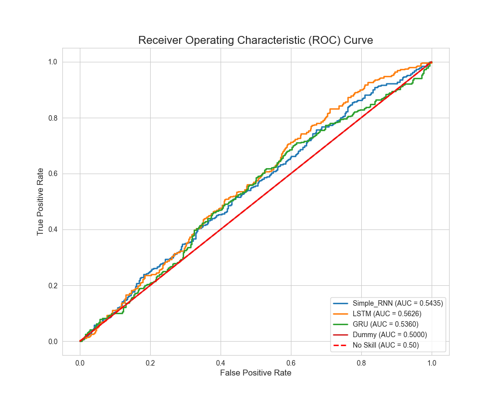
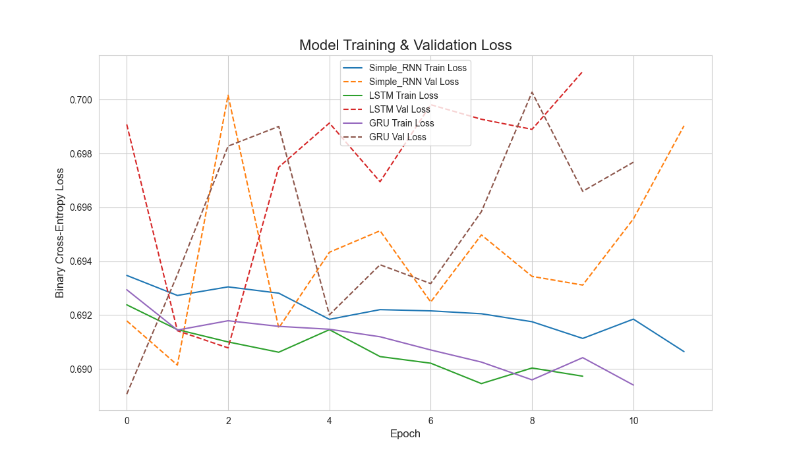

# A Comparative Analysis of RNN Architectures for Multivariate Financial Forecasting

## 📌 Abstract
Financial market forecasting is characterized by a high degree of noise, making precise price prediction an intractable problem. This project reframes the task as a binary classification of price direction ("Up" or "Down") and provides a rigorous comparative analysis of three recurrent neural network architectures: **Simple RNN, LSTM, and GRU**.

The models were trained on a multivariate, 10-year (2014-2023) dataset of four technology stocks (AAPL, META, NFLX, TSLA). The results demonstrate that while the baseline Simple RNN failed to generalize due to the vanishing gradient problem, the gated architectures (LSTM and GRU) captured predictive signals, achieving an AUC of ~0.56.

---

## 📂 Data & Preprocessing
The dataset comprises 10 years of daily OHLC data from **2014-01-02 to 2023-12-29**.
* **Target Variable:** Binary classification where `1` = Bullish (Next Day Close > Current Close) and `0` = Bearish/Neutral.
* **Feature Set (18 Total):** Adjusted Close, Volume, RSI (14-day), MACD, SMA (50/100), and EMA.

### Preprocessing Pipeline
1.  **Chronological Split:** Train (2014-2021), Validation (2022), Test (2023) to prevent lookahead bias.
2.  **Scaling:** MinMaxScaler (0, 1) fit on training data only.
3.  **Windowing:** A sliding window of **60 timesteps** (60 trading days) was used to capture sequential patterns.

---

## 📈 Exploratory Data Analysis (EDA)
An extensive EDA was conducted to identify the primary characteristics, temporal dependencies, and inter-relationships within the multivariate dataset.

### 1. Adjusted Close Prices (Trend Analysis)
The visualization of adjusted close prices on a logarithmic scale highlights the diverse growth trajectories and significant volatility differentials between the four assets (AAPL, META, NFLX, TSLA) over the decade.

*(Figure 1: Adjusted Close Prices (Log Scale))*

### 2. Daily Returns (Stationarity Check)
Unlike the raw price series which exhibits non-stationary trends, the daily percent returns are demonstrably stationary, oscillating around a mean of zero. This property is fundamental for time-series modeling, validating the choice to predict price direction rather than raw price levels.

*(Figure 2: Daily Percent Returns)*

### 3. Correlation Matrix (Multivariate Justification)
The Pearson correlation matrix reveals moderate to strong positive correlations (0.51 to 0.72) across all asset pairs. This indicates that the assets tend to move in sync with broader market sentiment, justifying a multivariate modeling approach to capture these shared patterns.

*(Figure 3: Correlation Matrix of Daily Returns)*

---

## 🧠 Model Architectures
Three distinct models were developed alongside a Dummy Classifier baseline. All neural networks shared a consistent architecture to ensure a fair comparison:

* **Input:** (60 time steps, 18 features).
* **Recurrent Layer:** 50 units (SimpleRNN, LSTM, or GRU) with Tanh activation.
* **Regularization:** Dropout (0.2).
* **Dense Layer:** 25 units (ReLU).
* **Output:** 1 unit (Sigmoid).
* **Optimization:** Adam optimizer with Binary Crossentropy loss.

---

## 📊 Results & Performance
The models were evaluated on the unseen Test Set (2023 data). The **Area Under the ROC Curve (AUC)** was the primary metric used to assess discriminative ability.

| Model | AUC | Accuracy | Precision | Recall | F1-Score | Train Time (s) |
| :--- | :--- | :--- | :--- | :--- | :--- | :--- |
| **LSTM** | **0.5599** | 48.55% | 0.4855 | 1.0000 | 0.6537 | 41.38 |
| **GRU** | **0.5568** | 48.55% | 0.4855 | 1.0000 | 0.6537 | 55.90 |
| **Simple RNN** | 0.5107 | 49.87% | 0.4464 | 0.1355 | 0.2079 | 20.53 |
| **Dummy** | 0.5000 | 51.45% | 0.0000 | 0.0000 | 0.0000 | 0.00 |

### 1. Receiver Operating Characteristic (ROC) Curve
The ROC curve visually confirms that LSTM and GRU (top lines) possess discriminative power significantly better than the Simple RNN, which hovers near the "No Skill" diagonal.

*(Figure 5: Receiver Operating Characteristic Curve)*

### 2. Training History (Vanishing Gradient)
The training history reveals a critical insight: The **Simple RNN's validation loss flatlined immediately**. This is a classic demonstration of the **vanishing gradient problem**, where the model failed to learn long-range dependencies from the 60-day sequences. In contrast, LSTM and GRU showed a clear learning curve.

*(Figure 6: Model Training & Validation Loss)*

---

## 🔍 Key Insights & Discussion

1.  **Superiority of Gated Architectures:** The LSTM (AUC 0.5599) and GRU (AUC 0.5568) significantly outperformed the Simple RNN. Their gating mechanisms successfully allowed error signals to backpropagate through time, capturing patterns the Simple RNN missed.
2.  **High Recall / Low Precision Bias:** The LSTM and GRU models achieved perfect Recall (1.0) but low Precision (~0.48). This indicates the models learned to identify "Bullish" trends but were overly optimistic, predicting "Up" too frequently.
3.  **Financial Feasibility:** While an AUC of 0.56 indicates predictive power better than random chance, the models are not yet suitable for standalone algorithmic trading. They serve better as confirmatory indicators within a larger decision-making system.

## 🚀 Future Improvements
* **Threshold Optimization:** Moving away from the default 0.5 classification threshold to maximize precision.
* **Exogenous Data:** Incorporating market sentiment, news, and macroeconomic indicators to improve signal-to-noise ratio.

---
*© 2025 Ryan Tang.*
